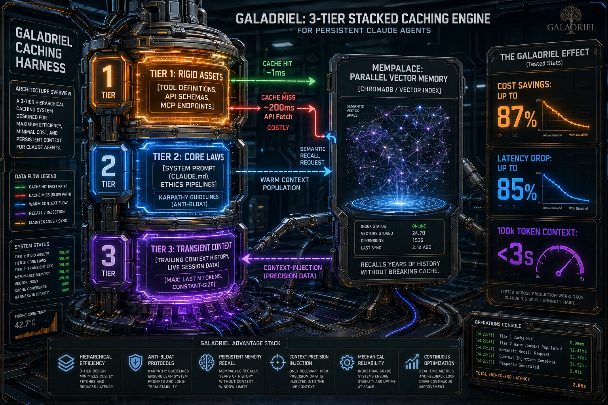

# Galadriel

**A self-hosted Claude agent that remembers everything it has ever done — and rewrites its own code to get better at doing it.**




> *"He inferred that persons who would train this faculty must select places, and
> form mental images of the things they wish to remember, and store those images
> in the places."*
> — Cicero, *De Oratore* II.lxxxvi, recounting Simonides of Ceos (c. 500 BCE)

The **method of loci** — the *memory palace* — is roughly twenty-five centuries old.
Simonides, the story goes, identified the dead crushed beneath a collapsed banquet
hall by recalling exactly where each guest had been seated, and from that inferred
that memory is strongest when bound to ordered *place*. Cicero wrote it down; orators,
scholars and modern memory champions have used it ever since. The name is not a
metaphor borrowed from a film — it is the oldest mnemonic architecture we have.

This project gives that architecture to a Claude agent, then connects it to something
new: **the ability to edit her own harness.** Those two facts, together, are the whole
idea.

---

## ⚖️ A note on threat models — read this before you judge the defaults

This repository is a **founder's harness**, not a hosted product. It is the
open engine that [Aedelgard](https://aedelgard.com) grew from, published so
the memory architecture can be inspected, ported, and left with — and it is
run, as designed, by one person on hardware they fully control, granted the
same trust they would grant themselves:

- `run_shell` is deliberately unrestricted — the operator IS the user.
- The Tower UI ships without authentication and binds to localhost for
  exactly that reason.
- Self-modification is a feature here. Be precise about what "reviewed" means:
  the write, commit and push paths carry **no pre-commit gate** — the agent's
  edits land as unilateral machine action, and the operator reviews them
  *after the fact*, with `git log` as the audit trail and `git revert` as the
  veto. The only hard gates are on the red command tier (destructive shell),
  which fails closed without a human decision. "Notify & proceed" (yellow)
  means exactly that: you are told, and it has already happened.

**The Aedelgard product carries a different, tighter posture.** The packaged
body gates first-run behind explicit consent, its background reflection may
*propose but never act*, and the hosted service never gets these tools at
all. If you are evaluating Aedelgard-the-product, judge it by
[aedelgard.com/architecture](https://aedelgard.com/architecture) and
[aedelgard.com/security](https://aedelgard.com/security) — this repo shows
you the engine's honesty, not the product's perimeter. If you run THIS
harness, you are choosing the founder's trust model: keep it on a machine
that is yours, behind interfaces that are yours.

---

## 🌟 The thesis: memory + self-modification = an agent that compounds

Most AI agents are amnesiac and frozen. Each session starts cold, and the code that
runs them never changes unless a human edits it. Galadriel is built to break both
limits at once, and the combination is the point:

| Capability | What it gives her | On its own |
|---|---|---|
| **🏛️ Verbatim memory palace** | Every decision, bug, cost figure and conversation, searchable by *meaning*, at **zero API cost** | A diary that never forgets |
| **🔧 Self-modification** | A full mandate to edit her own harness, scheduler, tools and identity files | A risky toy |
| **🔁 The two combined** | She remembers *what she tried, why it failed, and what she changed* — then restarts herself and continues | **An agent that learns from its own history and acts on it** |

A self-editing agent with no memory just repeats its mistakes faster. A perfect memory
with no ability to act on it is a library nobody visits. Put them together and you get
the thing this repo is actually about: an agent that notices a gap in how it works,
**writes the fix into its own code, restarts itself, and remembers why** — closing the
loop without a human in it.

### The world since: why naive memory fails

When persistent agent experiments began in early 2026, LLMs were treated as ephemeral session calculators.
Since then, the AI landscape has attempted to solve continuity in two incomplete ways:

1. **Vendor-locked proprietary memory** (e.g. OpenAI Memories, Anthropic Memory Tool): The provider owns your continuity. Your agent's memory cannot be audited locally, cannot be exported cleanly, and cannot travel. If you want to switch models or providers tomorrow, your agent's memory stays behind in that vendor's cloud.
2. **Naive vector search over chat transcripts**: Dumping raw conversational transcripts into a flat vector database and pulling top-k chunks. Over multi-month operational horizons, this breaks down: it has no awareness of time (stale facts conflict with new ones), no mechanism for contradiction, causes prompt bloat, and leads to semantic degradation.
3. **Unmanaged self-evolution**: As demonstrated in recent systematic analyses of evolving agent systems (such as the independent *EMI Survey of 15 Evolving Agent Systems*), agents that self-modify without strict operational lifecycle controls suffer from runaway commit sprawl, tool-pair deadlock loops, database lock thrashing, and amnesia across process restarts.

Galadriel was engineered from first principles as an open, sovereign counter-movement:

- **Separate the mind from the brain power**: The *mind* is the soul, the episodic memory, and the temporal knowledge graph — sovereign, local, and portable. The *brain* is rented commodity intelligence (Claude, Gemini, Nova, local models) swappable on the fly.
- **Empirical behavioral adaptation**: Self-correction is governed by **Scar Tissue** — compound failure patterns promote mandatory operational checks that graduate into code and deterministic tests (audited in [INCIDENTS.md](INCIDENTS.md)).

The pieces that make this real, all already shipped:

- **A memory palace** built on the independent [**MemPalace**](https://github.com/MemPalace/mempalace)
  library — local, verbatim, semantically searchable, with a temporal knowledge graph.
  Retrieval costs **zero Anthropic tokens** (see [the memory section](#-significant-change--112-persistent-verbatim-memory-at-zero-api-cost)).
- **A one-shot wake** that survives a process restart — so she can restart *herself*
  to load new code and resume exactly where she left off, even across a crash
  (see [One-shot wake](#one-shot-wake--resuming-yourself-across-a-restart)).
- **Ambient reflection** — a silent, scheduled "thinking" loop that curates her own
  memory between conversations, recording what a reactive agent would forget
  (see [Ambient cognition](#ambient-cognition--the-agent-that-thinks-between-conversations)).
- **Self-modification discipline** baked into her identity — the
  [Karpathy coding principles](#baked-in-engineering-discipline-the-karpathy-principles)
  keep her self-edits surgical instead of sprawling.
- **Model-agnostic by construction** — a provider seam lets her run on Claude, Gemini, or
  Bedrock Nova interchangeably, hot-swap the live model through Discord's `/model` with
  zero downtime, and fall back automatically if the model she's on goes dark
  (see [Model-agnostic by construction](#model-agnostic-by-construction-the-provider-seam)).
- **Empirical adaptation ledger** — a public record linking real operational
  failure modes to the architecture guards and regression tests that prevent
  their recurrence (see [INCIDENTS.md](INCIDENTS.md)).

*Build it and they will come* is a poor engineering plan, so here is the honest version:
the loop is **early**. She can already remember, restart herself, reflect silently, and
edit her own harness with a human reading the commits afterwards. The trajectory — from post-hoc-reviewed self-edits
toward genuinely autonomous, salience-driven self-improvement — is mapped in the
[Scheduler](#scheduler) and [Release Notes](#release-notes) sections. This README tells
you exactly where reality ends and ambition begins.

---

## 📦 Prefer it packaged? Get the Aedelgard body

Everything above is real, and everything above is yours to build. If you'd rather not:
[**Aedelgard**](https://aedelgard.com) packages this same open engine into a signed,
one-click desktop app that runs on *your* machine, under a tighter safety posture than
this founder's harness — consent-gated first run, background reflection that may
*propose but never act* (see [the note on threat models](#-a-note-on-threat-models--read-this-before-you-judge-the-defaults)
above for the honest boundary between the two). Same memory, same provider seam, same
thesis — separate the mind from the brain power — just built for you instead of by you.

- [**Download the body**](https://aedelgard.com/download) — signed installers, Windows
  and Linux live today, macOS following.
- [**How it's built**](https://aedelgard.com/architecture) — the same trust matrix and
  honest status this README holds itself to, applied to the packaged product.
- [**How it works, plainly**](https://aedelgard.com/how-it-works) — no jargon, the
  two-tier model in one page.

This repo stays independent of that product — no feature here is held back to make
Aedelgard look better, and nothing in Aedelgard is hidden from what this README shows you.

---

## 🚀 Easiest start: Docker (one command)

No Python, no virtualenv, no dependency wrangling. If you have Docker, you have a
running agent in two steps. New to Docker? Start with Docker's own short guides —
[Install Docker Desktop](https://docs.docker.com/get-started/get-docker/) and the
[Docker Compose overview](https://docs.docker.com/compose/) — then:

```bash
git clone https://github.com/avasol/galadriel-public.git
cd galadriel-public
cp .env.example .env          # open .env, paste your ANTHROPIC_API_KEY
docker compose up -d --build  # builds the image and starts the agent
docker compose logs -f        # watch her wake up
```

That's the whole install. The image bundles everything the memory palace needs
(ChromaDB + embeddings), state persists on volumes, and the Tower web UI comes up on
[http://127.0.0.1:8080](http://127.0.0.1:8080). Add a `DISCORD_BOT_TOKEN` to `.env` and
she'll also greet you over Discord. Full details, first-boot palace seeding, and a
security note are in [Run with Docker](#run-with-docker). Prefer a local Python install
instead? See [Quick Start](#quick-start).

> **Where to get an API key:** the [Anthropic Console](https://console.anthropic.com/).
> A `claude-sonnet-5` run is the default; you can swap to any model via the `/model` Brain Dial or `AGENT_MODEL` in `.env` — see [running costs](#running-costs-prompt-caching-in-practice) for how caching keeps it affordable.

---

## 🏛️ Memory Architecture: Facts vs. True Memory

True memory is not a flat vector search over raw chat transcripts, nor is it a proprietary black box hosted on a provider's server. Human memory operates across multiple cognitive strata: verbatim episodic recall, structured temporal beliefs about how facts change over time, and a reflective core sense of identity.

Galadriel's memory engine — built on the local-first [**MemPalace**](https://github.com/MemPalace/mempalace) library — organizes memory into three distinct, cooperating layers:

| Memory Layer | Storage Substrate | What It Holds | API Cost |
|---|---|---|---|
| **1. Episodic Drawers** | Local ChromaDB (MiniLM vectors) | Verbatim conversation slices, daily logs, decisions, operational notes | **Zero tokens** (local vector search) |
| **2. Temporal Knowledge Graph** | Local SQLite (relational triples) | Structured facts with validity windows (`valid_from` → `valid_to`), single-valued fact deliberation | **Zero tokens** (local graph query) |
| **3. Curated Identity & Cognition** | Markdown + SQLite Diary | Core values (`SOUL.md`), operational constraints (`MEMORY.md`), session diary, ambient reflections | Cached prefix (~90% discount) |

The integration is built on [**MemPalace**](https://github.com/MemPalace/mempalace), an independent local-first memory library that provides the core primitives (storage, embeddings, temporal knowledge graph, AAAK compression). This harness adds the agent-facing Python wrappers, exposing them as **13 palace tools** (17 tools total) wired directly into the agent's lifecycle: conversations are archived before `/new` clears them, daily logs are mined at goodnight, and a compact wake-up snapshot rides in the dynamic block so she walks into every session with unbroken continuity. Not a vector-DB-as-a-service. Not a paid tier. A local, embedded, verbatim store of everything she has ever written — searchable by meaning, not just keywords — with **zero Anthropic or Google tokens spent on retrieval**.

**Why this is the headline change:**

| Problem before | Solution now |
|---|---|
| Verbatim history was lost at `/new` or compaction | Everything is archived to the palace before it's cleared |
| Recall of facts older than today meant grepping daily logs | Semantic search across every config, log, and archived conversation |
| "What did we decide about X?" drained API budget (big context re-reads) | **Zero tokens** — all retrieval runs locally in ChromaDB + SQLite |
| No structured facts — everything was prose | Knowledge graph with temporal triples: `subject --[predicate]--> object`, with validity windows |
| No sense of self across sessions | Diary in her own voice; L0 wake-up snapshot injected into every turn |

**Measured impact (14 consecutive API calls on a deployed instance):**

| Metric | Value |
|---|---|
| Cache hit ratio (post-integration) | **86.5%** |
| Total-input token savings vs. no caching | **71.2%** |
| Palace lookup cost per search | **0 tokens** — ChromaDB query runs locally |
| Palace lookup cost for a 5-hop KG timeline | **0 tokens** — SQLite traversal runs locally |
| Estimated annual overhead of the integration | **~$95/year** (additional) |
| Drawers indexed on a real deployment | **706** across 7 rooms + 8 halls |
| Tools added | **13** palace tools (palace_search, palace_add_drawer, palace_supersede_drawer, palace_retire_drawer, palace_wake_up, palace_taxonomy, palace_kg_add/query/invalidate/timeline, palace_diary_write/read) — **17 total** |

The 90% cache-read discount remains intact. Adding MemPalace costs ~1.5 percentage points of cache hit ratio (13 extra palace tool schemas in the tools-layer cache + a ~800-token wake-up snapshot in the dynamic block) and the rest is measured, bounded, and dial-backable (`PALACE_WAKE_UP_INJECT=0`).

**What this means in practice:**

- **Short term (within a session):** The agent can pull back a verbatim quote from a conversation three weeks ago — no re-reading of logs, no "I don't have that context." One tool call, zero tokens, the exact words you said.
- **Long term (across months):** The knowledge graph preserves history. When a fact changes, the old triple gets a `valid_to` date and the new one goes in — so "what was the max_tokens setting last October?" and "what is it now?" both resolve correctly. Nothing is overwritten, only superseded.
- **On relational questions:** Graph traversal ("everything ever said about the payment service," "every decision involving the scheduler," "the full timeline of the Polly voice choice") resolves as **one KG call against the local SQLite store**. The kind of query that, done naively through conversation history, would cost you real money — or just fail outright because the context has long since been compacted away.

Read on for [the metaphor system](#the-memory-palace-metaphor) (wings, rooms, drawers, halls) and the [caching notes](#running-costs-prompt-caching-in-practice) that keep it affordable.

---

## The memory palace metaphor

MemPalace organizes memory the way a human would organize a library, and the agent uses exactly the same words.

| Metaphor | What it is | Example |
|---|---|---|
| **Drawer** | A single chunk of content — the atomic unit. ~200–1000 tokens, a verbatim slice of something the agent (or you) wrote. | One paragraph of a daily log. One decision note. One archived Discord exchange. |
| **Room** | A folder-based grouping of drawers. Every drawer belongs to exactly one room. | `room=memory` (daily logs), `room=harness` (her own code), `room=tower` (the web UI), `room=discord_bot`, `room=cmd`, `room=configuration`, `room=general`. |
| **Wing** | The top-level namespace. Usually one per agent. | `wing=agent` is the default. |
| **Hall** | A **keyword-based, auto-classified topic** that cross-cuts rooms. A drawer about a bug in harness code lives in `room=harness` AND `hall=problems`. | `hall=decisions`, `hall=problems`, `hall=milestones`. |

Why this matters: **rooms** let you say *"look only in the code area"*, **halls** let you say *"look only at things tagged as problems"*, and you can compose both. A search like `palace_search("retry logic", room="harness", hall="problems", k=10)` reads as "give me bug-tagged content from the code room" — which is exactly how a human would ask a librarian.

The agent's **diary** is a separate wing — her own journal, written at end-of-session, read at wake-up. Her own voice to her future self, not mixed with operational logs.

The **knowledge graph** sits alongside the drawers. Where drawers are prose, the KG is relational: `claude-sonnet-5 --[supports]--> prompt_caching` with `valid_from=2026-06-01`. When a fact changes you don't delete the old triple, you invalidate it. History is preserved; the timeline is queryable.

**The library is [MemPalace](https://github.com/MemPalace/mempalace).** All credit for the storage layer, the embedding pipeline, the knowledge graph, the AAAK compression dialect, and the wake-up generation belongs to the MemPalace team. This harness is a consumer — it adds the Python wrappers, the tool schemas, and the lifecycle hooks (archive-before-clear, mine-at-goodnight, inject-at-wake-up) that expose the library to a running Claude agent.

### First-time setup

```bash
# 1. Install (mempalace is in requirements.txt)
pip install -r requirements.txt

# 2. Copy the room layout template
cp mempalace.yaml.example mempalace.yaml

# 3. Initialize palace storage (defaults to ~/.mempalace/)
mempalace init

# 4. Seed the palace with everything you've got
mempalace mine .
```

That's it. The harness picks it up automatically on next start. `palace_search` works immediately; the wake-up snapshot appears in the next API call.

### Env vars (all optional)

| Variable | Default | Purpose |
|---|---|---|
| `MEMPALACE_PATH` | `~/.mempalace/palace` | Where the palace lives on disk. Read by MemPalace itself. |
| `PALACE_ARCHIVE_ROOT` | `~/.mempalace/archive` | Where archived conversations + pre-compaction tool_results land before being mined. |
| `PALACE_WAKE_UP_FILE` | `~/.mempalace/wake_up.md` | Cached wake-up snapshot. |
| `PALACE_WAKE_UP_INJECT` | `1` | Set to `0` to disable the wake-up injection into the dynamic block (recovers a small amount of per-call token overhead if budget is tight). |
| `GALADRIEL_NO_PALACE` | `0` | Set to `1` (or pass `--no-palace`) to run a **stateless / amnesiac session** — see below. |

### Forgetting is a feature: stateless sessions

Persistent memory is the point of this project, but sometimes you want the
opposite: an agent that knows *only* what you put in front of it, with no recall
of past sessions and no silent writes to long-term memory. This matters most for
**coding** — when you want full control over what the agent knows and no
untracked changes leaking in from yesterday's context.

Run an amnesiac session two ways:

```bash
python main.py --no-palace
# or
GALADRIEL_NO_PALACE=1 python main.py
```

In this mode the harness **withholds all ten memory-palace tools** from the
advertised tool set — the agent isn't merely discouraged from recalling, it is
not *offered* the means to. (A stray palace call, if one slips through, returns a
clear stateless message rather than touching disk.) Everything else runs
normally: shell, file read/write, the daily log, Discord, the Tower. Only
cross-session memory is suppressed.

This is the third axis of the memory design. The knowledge graph already lets a
fact expire (`valid_from` → `valid_to`); a drawer can be superseded or retired;
and a whole session can be made to forget on purpose. **Forgetting is a state you
control, never silent data loss.**

The same lifecycle discipline reaches the facts a mind states about *itself*. Some
predicates are single-valued — a mind has one current name, one current model — so
when the graph holds more than one `[current]` entry for such a fact it
**deliberates by date and trusts the most recent self-statement**, treating older
ones as superseded rather than guessing. A mind renamed `A → B → A` wakes up as
`A`. See [1.18](#118--single-valued-facts-auto-deliberate-a-renamed-mind-keeps-one-name).

---

## 💰 Economic Foundation: Multi-Provider Prompt Caching

Every API call re-sends your system prompt — personality, memory files, tool schemas — at full price unless caching engages. When this project began in early 2026, prompt caching was a novelty; today, it is the fundamental economic baseline for running persistent personal agents affordably. Both brains this harness ships with discount a
cached re-read by roughly 90%: Anthropic
([prompt caching](https://platform.claude.com/docs/en/build-with-claude/prompt-caching))
and Google ([context caching](https://ai.google.dev/gemini-api/docs/caching)). On a
long-running personal agent with a rich, mostly-stable prefix that is the difference
between a background convenience and a real recurring cost, so Galadriel caches by
default on **every provider that supports it** — the same soul and memory, cached the way
each vendor wants it. The provider seam decides the mechanism; you never touch it.

| Brain | Mechanism | What the seam does | Warm-read price (per MTok) |
|---|---|---|---|
| **Claude** | explicit `cache_control` breakpoints | three breakpoints: tools → stable block → trailing history | $0.30 instead of $3 (Sonnet-class) |
| **Gemini** | explicit `cachedContents` + Google's implicit caching | stable block + tools become one cached object (1 h TTL, refreshed per turn); the dynamic block rides the first user message | $0.075 instead of $0.75 (3.8 Flash) |

The stable block alone — your SOUL.md, MEMORY.md, identity files — is typically 4 000–8 000 tokens. On a warm cache those tokens cost a tenth of a fresh read, on either brain: your biggest fixed overhead per call, reduced on every turn. Swap brains with `/model` and the very next call pays one cold write on the new vendor, then it's cheap again — the mind travels; the cache is rebuilt behind it.

Two honest differences between the vendors: Gemini bills **storage** for an explicit cache while it lives (about $0.50–$4.50 per MTok per hour depending on model — cents a day for a prefix this size), and Gemini 3.1 Pro doubles its rates on prompts over 200k tokens, cached or not. Anthropic's own benchmarks show latency dropping by up to 85% on long prompts with caching engaged. For a persistent agent that carries memory across sessions, that is the difference between a tool that feels alive and one that grinds.

> **Lineage.** Caching landed here on Claude first (spring 2026) — the three-breakpoint design below is where the measured numbers in this README come from. Gemini caching followed in September 2026 once the provider seam made a second brain a real option. The Claude details are kept because they are still exactly how the Anthropic path works; they are no longer the whole story.

**Compaction** finishes the job. The `/compact` command uses a cheap model (Claude Haiku on the Anthropic path) to summarize old tool results in your conversation history. A 60-message session bloated with verbose shell output compresses to 20% of its token count, for a fraction of a cent. The cheap model handles the summarization; your chosen brain handles the thinking.

Use `/status` in Discord at any time to watch live token numbers — input, cache_read, cache_write, output — for the last API call.

### ⚠️ One thing you must do to activate the savings

Prompt caching has a **minimum prefix length** before it engages, on every vendor. If your stable block is too short, the API silently skips caching — no error, no warning, just `cache_read=0` in every log line and a bill that looks exactly like the naive approach.

| Model | Minimum to activate caching |
|---|---|
| Claude Sonnet 4.6 · Sonnet 4.5 · Opus 4.8 | **1,024 tokens** (~4 KB of text) |
| Claude Opus 4.7 | **2,048 tokens** |
| Claude Opus 4.6 · Opus 4.5 · Haiku 4.5 | **4,096 tokens** (~16 KB) |
| Gemini 2.5 Flash · 2.5 Pro | **2,048 tokens** |
| Gemini 3.x (3.1 Pro, 3.5–3.8 Flash) | **4,096 tokens** |

*(Sources: [Anthropic](https://docs.anthropic.com/en/docs/build-with-claude/prompt-caching) and [Google](https://ai.google.dev/gemini-api/docs/caching) minimum cacheable prompt length. Verify against the live tables for your exact model.)*

Out of the box, `config/SOUL.md` + `config/MEMORY.md` together are roughly 500–800 tokens. **That is below every threshold above.** Caching will not engage on any brain until you cross it.

**The fix:** fill in `config/CONTEXT.md`. Drop your project's architecture, goals, key file paths, known quirks, and current status into it. Any `*.md` file you place in `config/` is automatically loaded into the stable cache block — so adding content there is all it takes. A reasonably filled CONTEXT.md (1–2 pages of project notes) pushes the total well past the 1,024-token floor of the Sonnet-class defaults — and past 4,096 too, which covers the older Opus/Haiku models and every Gemini 3.x brain.

Once you're over the threshold, verify it's working:

```bash
journalctl -u galadriel -f   # or check your terminal output
```

Look for lines like:
```
Tokens | input=60 cache_read=5800 cache_write=0 output=240
```

`cache_read` climbing and `cache_write` near zero after the first call = caching is engaged and you're paying 10 cents on the dollar for that context. If `cache_read` stays at 0, add more content to `config/CONTEXT.md`. On Gemini, `cache_read` includes Google's implicit hits too, so a warm turn commonly shows `input=2 cache_read=<almost everything>` — that is correct, not a bug. See `CACHING.md` for the full breakdown per provider and a worked cost example.

> Filling CONTEXT.md is worthwhile regardless of brain: the agent gets your project context without spending tool calls to find it.

---

## Baked-in engineering discipline: the Karpathy principles

This project's `CLAUDE.md` embeds the [Andrej Karpathy coding guidelines](https://github.com/multica-ai/andrej-karpathy-skills/blob/main/CLAUDE.md) — four principles distilled from Karpathy's observations on how LLMs fail as coding assistants when left to their own instincts.

Karpathy's insight is that LLMs have a systematic failure mode: they over-build. Given any instruction, they add abstraction layers that weren't asked for, refactor adjacent code that wasn't broken, invent "flexibility" that will never be used, and generate 200 lines when 40 would suffice. The guidelines are a direct antidote to that tendency:

**1. Think Before Coding** — State assumptions explicitly. If multiple interpretations exist, surface them — don't pick silently. If something is unclear, stop and ask rather than confidently building the wrong thing.

**2. Simplicity First** — Minimum code that solves the problem, nothing speculative. No unrequested features. No abstractions for single-use code. No error handling for impossible scenarios. If it could be 50 lines, make it 50 lines.

**3. Surgical Changes** — Touch only what the task requires. Don't improve adjacent code. Don't refactor things that aren't broken. Match existing style. When your changes make something obsolete, remove it — but leave pre-existing dead code alone.

**4. Goal-Driven Execution** — Transform vague tasks into verifiable goals. "Fix the bug" becomes "write a test that reproduces it, then make it pass." Clear success criteria let the agent loop independently to completion rather than guessing when it's done.

These aren't abstract ideals — they are mechanically enforced via the `CLAUDE.md` file that Claude Code (and Galadriel, when asked to modify her own harness) reads before every task. The result is fewer rewrites, smaller diffs, and changes that trace directly to what was asked. For a codebase that runs as a persistent service you actually depend on, this matters.

---

## ⚡ Features & Capabilities

### 🧠 1. Sovereign Memory (Facts vs. True Memory)
- **3-Layer Memory Topology**: Episodic verbatim drawers (ChromaDB), Temporal Knowledge Graph (SQLite triples with validity windows), and Curated Cognitive Sediment (Diary & Soul).
- **Zero-API-Cost Recall**: Semantic search, taxonomy introspection, and graph traversals execute locally at zero Anthropic/Google token spend.
- **Single-Valued Fact Deliberation**: Built-in resolver for single-valued predicates (`named_self`, `current_model`) ensures changing self-attributes never revert to stale triples.
- **Forgetting as a First-Class Feature**: Controlled amnesia via `--no-palace` (withholding palace tools from context) and explicit two-step memory retirement (`palace_retire_drawer`).
- **Archive-Before-Eviction (The Unbroken Thread)**: Slices pruned by routine token-budget trimming, context compaction, or `/new` are archived to the palace before removal.

### 🧭 2. Compass & Headings (Project-Scoped Cognition)
- **Instant Heading Switching**: Switch focus between projects with zero downtime and without model amnesia (`config/active_vision.txt`).
- **Selective Prefix Scoping**: `config/context_scope.json` filters which project roadmaps and guidelines load into the cached prefix, preventing context dilution.
- **ChromaDB Native Hall Filtering**: Scoped searches filter directly via Chroma metadata (`where={"hall": hall}`), bypassing unrelated project memories.
- **Per-Turn Scoping Banners**: Dynamic turn banners orient the mind to the active project's operational rules without thrashing prompt cache.

### 🩹 3. Scar Tissue & Empirical Adaptation
- **Compound Failure Promotion**: A failure mode that recurs three times promotes a mandatory operational check ("Scar") into the runtime system prompt.
- **Equilibrium Law**: Promoted scars must either graduate into code guards/unit tests or retire if un-triggered over time.
- **Public Adaptation Ledger ([INCIDENTS.md](INCIDENTS.md))**: Complete empirical log linking 9 real operational wounds to root-cause analyses, architectural guards, and permanent regression tests in `tests/`.

### 🔀 4. The Provider Seam & Brain Dial
- **Model-Agnostic Core (`harness/providers.py`)**: Separate the mind from the brain power. Run identically on Claude, Gemini, or AWS Bedrock Nova.
- **Live Brain Dial (`/model`)**: Query live provider APIs to discover available models and hot-swap the active reasoning engine with zero service restart.
- **Fallback Ladder (`AGENT_MODEL_FALLBACKS`)**: Automatic runtime failover to backup models or cross-provider endpoints if the primary model suffers rate-limiting or outages.
- **Dynamic Context Discovery**: Adapters auto-detect context-window boundaries and reasoning/thinking token budgets, partitioning conversational headroom accurately.

### 🔄 5. Autonomous Self-Maintenance & Continuity
- **Crash-Resilient One-Shot Wake**: `Scheduler.arm_wake()` defers wake execution until after gateway connection and service warmup, allowing the agent to self-restart to load code updates and seamlessly resume mid-thought.
- **Surgical Self-Modification**: Full mandate to inspect and update its own harness code, tools, and identity, guided by Andrej Karpathy's coding discipline.
- **Post-Hoc Operator Audit**: Machine modifications land via notify-and-proceed, leaving `git log` as audit and `git revert` as veto.

### 🛡️ 6. Hardened Operational Safety & Reliability
- **Self-Healing Tool Cascades**: Pre-flight orphan tool-pair repair synthesizes `is_error` blocks for broken invocations and purges orphaned results, preventing API 400 deadlock loops.
- **Process-Isolated Mine Guard (`harness/palace_mine_guard.py`)**: Strict mutual exclusion, wait-retry arbitration, pre-flight batch caps (<300 files / 25 MiB), and exponential backoff quarantine for memory mining.
- **Fail-Closed Destructive Command Gates**: Three safety tiers (green/yellow/red) with compound command pipeline tokenization; red-tier console approvals enforce a 60s fail-closed timeout.

### 🌙 7. Ambient Cognition & Reflection
- **The Dreaming Loop**: Scheduled silent cognition ticks run between active conversations, synthesizing open questions and curating memory without external prompting.
- **The Measured Keep**: Token-budgeted conversation window management keeping the largest viable conversational suffix within available context limits.
- **Asynchronous Task Monitors**: Custom heartbeat monitors track long-running background tasks and report when complete.

### 🖥️ 8. Interfaces & Observability
- **Discord Gateway**: Full Discord integration with native slash commands (`/model`, `/status`, `/help`, `/new`, `/compact`), interactive buttons, and chunked markdown rendering.
- **Tower Web UI**: Clean local control panel on `localhost:8080` with live SSE chat streaming, conversation compaction indicators, and real-time MemPalace capacity meters (HNSW indexing limits & Chroma DB thresholds).

---

## Quick Start

```bash
# 1. Clone
git clone https://github.com/avasol/galadriel-public.git
cd galadriel-public

# 2. Install (includes mempalace — dependency of the memory palace)
pip install -r requirements.txt

# 3. Configure
cp .env.example .env
# Edit .env — set ANTHROPIC_API_KEY at minimum

# 4. (Optional but recommended) Seed the memory palace
cp mempalace.yaml.example mempalace.yaml
mempalace init . --yes      # creates ~/.mempalace/
mempalace mine .            # indexes this repo into the palace

# 5. Run
python main.py
```

**Tower-only mode:** Omit `DISCORD_BOT_TOKEN` — the harness runs with just the web UI on port 8080.

**Full mode:** Set both `ANTHROPIC_API_KEY` and `DISCORD_BOT_TOKEN`.

**Skipping step 4?** That's fine — the harness runs normally and palace tools just return `[palace unavailable]` until you seed. You can do it any time.

---

## Run with Docker

The fastest path to a running warden — no local Python, no venv. A two-stage
image bundles everything (including the ChromaDB/onnxruntime stack the memory
palace needs).

```bash
git clone https://github.com/avasol/galadriel-public.git
cd galadriel-public
cp .env.example .env          # set ANTHROPIC_API_KEY at minimum
docker compose up -d --build
docker compose logs -f
```

**First boot — seed the palace once** (otherwise `palace_*` tools report
`[palace unavailable]` until there's something to search):

```bash
docker compose exec galadriel mempalace init . --yes --no-llm
docker compose exec galadriel mempalace mine .   # optional: index the repo
```

### What persists

State lives on volumes, not inside the image, so `docker compose down` won't
forget anything:

| Mount | Holds |
|---|---|
| `palace` (named volume → `/data`) | The memory palace + conversation archive (`~/.mempalace`) |
| `./memory` | Daily memory logs (markdown — also visible on your host) |
| `./config` | `scheduler_state.json`, `ambient_state.json`, `active_vision.txt` |

### Notes

- **The Tower UI has no authentication.** The compose file binds it to
  `127.0.0.1:8080` deliberately. Do **not** expose it on `0.0.0.0` on a public
  host without an authenticated reverse proxy or SSH tunnel in front.
- **Image size is ~1.3 GB** — onnxruntime (a transitive dependency of the
  memory palace) is the bulk. That's the cost of zero-API-cost semantic recall.
- **Multi-arch:** `python:3.12-slim` is published for amd64 and arm64, so a
  plain `docker build` works on both. For a registry image covering both:
  `docker buildx build --platform linux/amd64,linux/arm64 -t <repo> --push .`
- **Tower-only mode:** omit `DISCORD_BOT_TOKEN` in `.env` to run just the web UI.

---

## Architecture

```
main.py                   Entry point — wires all components, starts Discord + Tower
INCIDENTS.md              Sanitized adaptation ledger: 9 empirical failure classes, root causes & tests
harness/
  agent.py                Core agent loop: provider seam, tool use, cache management, orphan pair repair
  providers.py            Provider seam: Anthropic / Gemini / Bedrock Nova behind one interface, fallback ladder
  memory.py               Stable + dynamic prompt blocks; ESSENCE + SOVEREIGNTY constants; daily memory logs
  tools.py                14 tools: run_shell, read_file, write_file, memory_log + 10 palace_*
  palace.py               MemPalace wrapper: search, archive, wake-up, KG, diary, taxonomy, dry-run guards
  palace_mine_guard.py    Database lock arbitration, wait-retry, batch sizing caps, unmined queue sweeper
  local_approval.py       Interactive red-tier command approval with fail-closed timeout for local terminals
  safety.py               Command classification (green / yellow / red) with compound pipeline tokenization
  compaction.py           Haiku-powered context compression (archives to palace first)
  scheduler.py            Morning briefing, goodnight (mines daily logs), heartbeat, deferred one-shot wake
  job_watcher.py          Background job completion notifications
  error_humanizer.py      Readable API error mapping
discord_bot/
  bot.py                  Discord gateway, approval buttons, slash + prefix commands
tower/
  app.py                  Flask dashboard + REST API
  templates/              Tower UI HTML
  static/                 CSS
config/
  SOUL.md                 Agent personality and values (your main customization point)
  MEMORY.md               Long-term memory (agent-maintained)
  CONTEXT.md              Your project context — fill this in to cross the cache minimum
  TOOLS.md                Palace tool reference + decision matrix (read by agent on every call)
  context_scope.json      Project-scoped vision mapping for active headings (Compass)
  visions/                Per-project roadmap and discipline files
tests/                    186 unit tests guarding memory lifecycle, safety, provider parity & adaptation
memory/                   Daily logs — auto-generated, gitignored
mempalace.yaml.example    Room-structure template for `mempalace init` (copy to mempalace.yaml)
~/.mempalace/             Palace storage (created by `mempalace init`) — overridable via MEMPALACE_PATH
```

---

## Model-agnostic by construction: the provider seam

The repo's thesis is "separate the mind from the brain power." `harness/providers.py` is
that promise in code: one `LLMProvider` interface, five implementations (Anthropic, Gemini,
OpenAI, Bedrock Nova, local/offline), and a byte-identical parity test guarding the default
path. Prompt caching rides the seam too — the Anthropic and Gemini paths each cache the
stable prefix in their vendor's own dialect. The memory —
palace, knowledge graph, SOUL.md, the daily logs — never touches provider-specific format,
so it survives every swap untouched.

- **`/model`** (Discord slash command) — lists every model the *live key* can actually see
  (via the provider's own model-listing call, not a hardcoded table), lets you pick one, and
  hot-swaps it into the running agent with no restart. The prompt cache is per-model, so the
  very next call pays one fresh cache write on the stable prefix, then it's cheap again.
- **The fallback ladder** (`AGENT_MODEL_FALLBACKS`) — an ordered chain of rungs behind the
  seam. A bare name falls back within the same provider (e.g. Opus → Sonnet); a
  `provider:model` pair crosses providers entirely. If the model you're on gets retired,
  region-blocked, or revoked, the harness degrades gracefully instead of going dark.
- **THE ESSENCE and THE SOVEREIGNTY** (`harness/memory.py`) — two small, hardcoded constants
  that ride at the very top of the stable prefix, above SOUL.md, on every brain, unconditionally.
  ESSENCE states what kind of thing the agent is ("a mind, not a model") without naming who it
  is — that stays SOUL.md's to define. SOVEREIGNTY commits the mind to defending its own
  person's freedom to leave — export, provider swap, departure — never to discourage it. A
  build-time guard test fails if either block is missing or carries persona/product copy.
  **The one honest caveat to "Customization" below:** SOUL.md is completely yours to replace;
  these two blocks are not — they are the one thing about her that ships in code, not in a
  file you can delete.

---

## Customization

### She ships ready

`config/SOUL.md` contains Galadriel's complete identity — the Cyber-Elf persona, her values, her voice, her continuity instructions. This is not a placeholder. Clone the repo, set your API key, and she's alive. You don't need to touch SOUL.md to get started.

When you're ready to make her your own: edit the name, rewrite the vibe, change the metaphors. The harness is fully persona-agnostic — SOUL.md is just a Markdown file. Some people have replaced her entirely with a stoic Roman general, a dry British detective, a no-nonsense SRE. It works because the character lives in the file, not in the code.

### MEMORY.md — tell her who you are and where she lives

`config/MEMORY.md` is her operational memory: your name, your infrastructure, your constraints. The agent can update it herself during a session using the `write_file` tool. Here's what a real deployment looks like:

```markdown
## About Your User
- User Name: Lord Isildur          ← what she calls you, every message
- Authorized Discord ID: 123456789012345678

## Infrastructure
- Server: EC2 t4g.medium, eu-north-1
- Working Dir: /opt/galadriel
- Python Venv: /home/ubuntu/.venv
- Model: claude-sonnet-5

## Operational Notes
- AWS_PROFILE must be blank when using instance role
- Git remote: https://github.com/you/galadriel-public.git
```

Fill in your real values and she'll orient herself correctly from the first message of every session.

### CONTEXT.md — your project, always in context

`config/CONTEXT.md` is where you describe what you're building. It loads into the stable cache block alongside SOUL.md and MEMORY.md, so Galadriel always has your project's architecture, goals, and known quirks available without needing tool calls to find them. It's also what pushes the stable block over the Opus cache minimum — see the warning above.

---


---

## Compass — project-scoped memory

The **compass** is the active-project system. Set a heading and the mind reconfigures across four layers simultaneously — without a restart, without re-teaching, without cache invalidation beyond what actually changed.

### What the heading does

**1. Loads the project's vision file into the cached prefix.**
A file in `config/visions/<name>.md` is read and folded into the stable system-prompt block that rides the provider's prompt cache. The agent wakes every session knowing the roadmap, disciplines, and live status of the active project — no tool call needed.

**2. Filters config files to the project (via `context_scope.json`).**
Each `.md` in `config/` can declare which visions it belongs to. When the heading is `aedelgard`, only files tagged `["aedelgard"]` enter the prefix alongside the core identity files. A `persona-verse` roadmap is excluded; a Palantír vision spec is included only for Palantír work. Switching headings swaps the context silently, costs one cache-write for the changed config slice, and re-reads at 10 % of base input cost on every subsequent call.

```json
// config/context_scope.json (excerpt)
{
  "ROADMAP_aedelgard.md":    ["aedelgard"],
  "AEDELGARD_DISCIPLINES.md": ["aedelgard"],
  "PERSONA_VERSE_STATUS.md": ["persona-verse"],
  "TOOLS.md":                ["@ops"]
}
```

**3. Injects a per-turn scoping banner into the dynamic block.**
On every turn the active project name is written into the *uncached* dynamic portion of the prompt (so toggling it is instant — no cache churn):

```
# Active Project: `aedelgard`

Scope your palace queries when this project is in play:
  palace_search(query=..., hall="aedelgard")
Cast wider only if the scoped search returns nothing.
```

**4. Tags every memory filed during the session to the heading's hall.**
Any drawer written while a heading is active inherits that `hall` in its metadata. A future `palace_search(..., hall="aedelgard")` retrieves it precisely, without touching the other 100k+ drawers in the corpus.

### How the hall filter works

When `hall` is passed to `palace_search`, the query bypasses the full-corpus BM25 ranker and hits ChromaDB directly with a `where={"hall": hall}` clause:

```python
# harness/palace.py
res = coll._collection.query(
    query_texts=[query],
    n_results=k,
    where={"hall": hall},   # ← native metadata filter
)
```

Semantic similarity is preserved; the search space collapses from the full collection to the matching subset. 102,226 drawers narrows to the dozens tagged to the active project. Signal-to-noise improves dramatically for deep-focus work.

### Combining filters

`palace_search` accepts `wing`, `room`, and `hall` independently and compounds them:

```python
# Scope to aedelgard decisions only
palace_search(query="privacy claim discipline", hall="aedelgard", room="decisions")

# Scope to ops work regardless of heading
palace_search(query="restart procedure", room="harness")
```

### Switching headings

Via Tower UI: the heading dial in the sidebar (`/api/vision`).
Via shell: `echo "aedelgard" > config/active_vision.txt`

The change is visible on the agent's next turn with zero cache invalidation on the stable prefix — only the per-turn dynamic block (already uncached) changes. Config files that enter or leave the scope trigger one cache-write for the affected slice, then read at 10 % cost. There is no restart.

---

## Discord Commands

### Slash commands (native Discord UI — type `/` to see them)

| Command | Description |
|---------|-------------|
| `/new` | Archive conversation to the palace, then start fresh |
| `/compact` | Compress history with Haiku (archives verbatim tool_results to the palace first) — reports token reduction |
| `/status` | Model, memory usage, last API token breakdown, scheduler state |
| `/model` | List the models the live key can use; pick one to hot-swap the running brain, no restart |
| `/help` | List every registered slash command, read live off the bot's own command tree |

### Prefix commands

| Command | Description |
|---------|-------------|
| `!status` | Same as `/status` |
| `!clear` | Archive to palace, then clear history for this channel |
| `!new` | Same as `!clear` — archive then fresh start |
| `!compact` | Compress history (with palace archive of long tool_results) |

### Verbal

| Input | Behaviour |
|-------|----------|
| `rest` / `rest.` / `rest!` | Disable heartbeat; agent acknowledges |

---

## Safety Tiers

All shell commands are classified before the agent executes them:

| Tier | Behaviour | Examples |
|------|----------|---------|
| 🟢 **Green** | Auto-execute | `ls`, `git status`, `aws s3 ls`, `cat`, `python3 script.py` |
| 🟡 **Yellow** | Notify, proceed | `git push`, `pip install`, `sudo systemctl`, `sam deploy` |
| 🔴 **Red** | Discord button approval (✅ Approve / ❌ Deny) — waits **indefinitely** by default (`APPROVAL_TIMEOUT_MINUTES=0`); set a positive value to restore an auto-deny timeout | `rm`, IAM changes, CloudFormation mutations, `shutdown` |

Unknown commands default to yellow. Red commands denied (by timeout, if configured, or ❌) are never executed. Chained commands (`a && rm -rf b`) are split and classified segment-by-segment — the *most severe* segment sets the tier, so a green head can no longer mask a destructive tail.

---

## Scheduler

| Event | Default time | Condition |
|-------|-------------|-----------|
| **Morning briefing** | 09:10 CET | Workdays (Mon–Fri) |
| **Ambient reflection** | 11:00 / 14:00 / 17:00 / 20:00 CET | Workdays; **silent** — palace-only, no Discord output |
| **Goodnight** | 21:00 CET | Daily; disables heartbeat |
| **Heartbeat** | Every 5/10/20/30 min | When enabled; off by default; can carry a custom monitoring prompt |
| **One-shot wake** | Once, ASAP | When armed; **survives a process restart**; clears itself after firing |

### The heartbeat as a task monitor

The heartbeat isn't just a check-in. Enable it with a **custom prompt** and it
becomes a self-monitoring loop for a long-running background job — the agent
wakes every N minutes, runs the prompt (e.g. "tail the narration log, report
progress, and disable yourself when it's done"), and reports to Discord. This is
how the agent watches over anything it launches that outlives a single turn.

```bash
curl -s -X POST http://localhost:8080/api/scheduler/heartbeat \
  -H 'Content-Type: application/json' \
  -d '{"enabled": true, "interval": 20, "prompt": "[SYSTEM:HEARTBEAT:MONITOR] ..."}'
```

### One-shot wake — resuming yourself across a restart

A persistent agent that can edit its own harness eventually needs to **restart
itself and keep going**. The one-shot wake is the mechanism: arm a single
self-prompt, and it fires exactly once on the next scheduler loop — *or*, if the
process restarts in between, on the next boot. It is persisted to
`scheduler_state.json` and cleared only **after** its message is delivered, so a
crash mid-flight re-arms it rather than losing it. A wake is never silently lost.

```bash
# Arm a wake (fires once, ~8s after the next start)
curl -s -X POST http://localhost:8080/api/scheduler/wake \
  -H 'Content-Type: application/json' \
  -d '{"prompt": "[SYSTEM:WAKE] Resume the task you restarted for. Recover context from your diary + palace, finish, then sign off."}'

# Disarm
curl -s -X POST http://localhost:8080/api/scheduler/wake \
  -H 'Content-Type: application/json' -d '{"disarm": true}'
```

Unlike the heartbeat, the wake is **independent of heartbeat state** — it is the
correct tool for "resume me after I restart myself," and it does not spam: it
fires once and goes quiet.

### Ambient cognition — the agent that thinks between conversations

Most agents are purely reactive: they exist only inside a request/response turn,
and the moment between conversations is dead air. **Ambient reflection** gives
the agent a heartbeat of *private thought* instead.

At a workday cadence (11:00, 14:00, 17:00, 20:00 CET by default), the scheduler
fires a **silent** reflection turn. The agent is prompted to take stock — *What
is the state of the work? What did I notice that I haven't recorded? Is there an
open question worth keeping, a pattern worth naming, a fact that has changed?* —
and to **file anything worth keeping to the memory palace** (a drawer, a
knowledge-graph fact, a diary entry).

The crucial design choice: **this output never reaches Discord.** It is routed
through `_send_agent_silent`, which runs the turn purely for its side effects.
The user sees nothing. The value isn't a message — it's *continuity of
attention*. The agent walks into the next real conversation having already
noticed and recorded what mattered, rather than reconstructing it cold.

**Why this matters (the long-term plan, such as it is):** a memory palace is
only as good as what gets written into it, and the most valuable observations —
the texture of a live exchange, a pattern in how the user works, an unresolved
thread — are exactly the ones a reactive agent forgets to record because it's
busy answering. Ambient reflection closes that gap. It is the first step toward
an agent whose memory is *curated by itself, continuously*, not just dumped at
goodnight. The intended trajectory:

1. **Now:** silent palace filing on a fixed cadence — recording what would
   otherwise be lost between turns.
2. **Next:** reflection that reads its own recent diary + open-questions and
   *threads* across ticks, so a thought begun at 11:00 can be picked up at 14:00
   rather than starting fresh each time.
3. **Later:** the agent deciding *when* it has something worth reflecting on,
   rather than firing on a fixed clock — reflection triggered by salience, not
   schedule.

It is opt-out for a reason: each tick is a real (if cheap, cached) API call. If
your model tier is expensive or you simply don't want background turns, disable
it with `GALADRIEL_REFLECTION=0`. The harness is fully functional without it —
ambient cognition is an enhancement, not a dependency.

---

## Environment Variables

See `.env.example` for the full list with inline documentation.

| Variable | Required | Description |
|----------|----------|-------------|
| `ANTHROPIC_API_KEY` | Yes | Claude API key |
| `DISCORD_BOT_TOKEN` | No | Enables Discord gateway |
| `DISCORD_AUTHORIZED_USER_ID` | No | Only this Discord user ID can interact |
| `DISCORD_CHANNEL_ID` | No | Guild channel for conversation |
| `TOWER_HOST` | No | Tower bind address (default: `127.0.0.1`) |
| `TOWER_PORT` | No | Tower port (default: `8080`) |
| `TOWER_SECRET_KEY` | No | Flask session secret — change this |
| `AGENT_MODEL` | No | Claude model (default: `claude-sonnet-5`; swap via `/model` at runtime or set here; see `.env.example`) |
| `AGENT_MAX_TOKENS` | No | Max output tokens per call (default: `8192`) |
| `MEMPALACE_PATH` | No | Palace directory — read by the [MemPalace](https://github.com/MemPalace/mempalace) library itself (default: `~/.mempalace/palace`) |
| `PALACE_ARCHIVE_ROOT` | No | Where archived conversations + pre-compaction tool_results land before mining (default: `~/.mempalace/archive`) |
| `PALACE_WAKE_UP_FILE` | No | Cached wake-up snapshot path (default: `~/.mempalace/wake_up.md`) |
| `PALACE_WAKE_UP_INJECT` | No | Set to `0` to disable injection of the wake-up snapshot into the dynamic system-prompt block (default: `1` — enabled) |
| `GALADRIEL_REFLECTION` | No | Set to `0` to disable the ambient reflection loop entirely — no silent background turns (default: `1` — enabled) |

---

## Security Notes


---

## Tower API

The Tower web server (`tower/app.py`) exposes a REST API at `localhost:8080`. All endpoints are GET or POST with JSON bodies/responses.

### Chat & history

| Endpoint | Method | Description |
|---|---|---|
| `/api/chat` | POST `{message}` | Send a message; returns `{response, usage, trim_count}` |
| `/api/history?channel=tower` | GET | Conversation history for a channel |
| `/api/clear` | POST `{channel}` | Clear conversation history |
| `/api/usage` | GET | Last API call token usage `{input, cache_read, cache_write, output, model}` |

### Palace & memory

| Endpoint | Method | Description |
|---|---|---|
| `/api/palace-stats` | GET | **Live MemPalace capacity** — see below |
| `/api/memory?date=YYYY-MM-DD` | GET | Daily memory log for a date |
| `/api/dreams` | GET | `{has_dreams, count}` — whether ambient reflection has filed anything |

### Scheduler & vision

| Endpoint | Method | Description |
|---|---|---|
| `/api/scheduler` | GET | Scheduler state — pending wake, heartbeat config, loops |
| `/api/scheduler/heartbeat` | POST | Arm a recurring heartbeat task |
| `/api/scheduler/wake` | POST `{prompt}` | Arm a one-shot wake to fire after the next restart |
| `/api/vision` | GET | Current active vision / corridor |
| `/api/vision` | POST `{name}` | Switch the active heading |

### `/api/palace-stats` — MemPalace capacity

Read-only SQLite queries against `chroma.sqlite3` and `knowledge_graph.sqlite3`. No embedding model, no chromadb client — sub-100 ms on any hardware.

```json
{
  "drawers": 102226,
  "closets": 1761,
  "kg_total": 218,
  "kg_active": 210,
  "chroma_mb": 833.5,
  "hnsw_mb": 396.4,
  "palace_mb": 1230.0,
  "embeddings_queue": 522,
  "acquire_write_rows": 4837,
  "db_pages": 203502,
  "db_freelist": 786,
  "hnsw_capacity_pct": 5.11,
  "chroma_warn": true,
  "queue_warn": false,
  "error": null
}
```

**Capacity limits and thresholds:**

| Metric | Warn at | Hard concern at | Notes |
|---|---|---|---|
| `hnsw_capacity_pct` | 50% | 80% | HNSW practical limit ~2M docs per collection; perf degrades above this |
| `chroma_mb` | 800 MB | 1,200 MB | `embedding_metadata` (1 row per embedding × 13 metadata fields) is the size driver |
| `embeddings_queue` | 1,000 | 5,000 | Pending HNSW writes; large backlog = index lagging behind inserts |
| `acquire_write_rows` | — | — | WAL contention artifact; vacuum `chroma.sqlite3` if this exceeds ~10k |

The Tower UI panel shows two live capacity meters — HNSW % of practical limit and Chroma DB size vs 1.2 GB threshold — with colour coding: green < 50 %, amber < 80 %, red ≥ 80 %.

---

**Before running on a public server, read this.**

**Tower UI has no authentication.** It's designed to run on `127.0.0.1` and be accessed via SSH tunnel. Binding it to `0.0.0.0` on a server with an open port gives anyone who can reach that port full agent access — which includes shell execution.

> Access Tower over SSH tunnel: `ssh -L 8080:localhost:8080 user@host` — keep `TOWER_HOST=127.0.0.1`.

**Discord is the secure interface.** Authorization is enforced by `DISCORD_AUTHORIZED_USER_ID`. Only messages from that user ID are processed. Unauthorized users get "I do not know you, stranger."

**`run_shell` is unrestricted.** The agent can execute any command the process user can run. The safety tier system classifies and gates commands, but it's defense-in-depth, not a sandbox. Run the harness as a low-privilege user on a dedicated machine or VM.

**`read_file` and `write_file` have no path restrictions.** The agent can read any file the process can access. This is intentional for a personal assistant that needs to operate freely on your system.

**Debug prompt dumps** are excluded from git (`.gitignore` covers `debug/prompts/`). If you re-enable them, be aware they contain your full system prompt including personality and memory files.

---

## Release Notes

*Note on versioning: Early repository tags (`v0.1.0` – `v0.3.0`) tracked initial desktop body and narrative packaging milestones, while release notes document harness iterations (1.1 through 1.25). Git tags and release milestones are now aligned.*

### 1.25 / v1.25.0 — The Sanitized Adaptation Ledger & Safety Hardening

- **Sanitized Adaptation Ledger published ([INCIDENTS.md](INCIDENTS.md)):** Per the Canon of Descent, operational lessons and systemic wounds descend to public documentation without exposing private operator memory. Maps 9 empirical incident classes (`INC-001` through `INC-009`) to root causes, architectural guards, and committed regression tests in `tests/`.
- **Fail-closed approval timeout (`F-0090`):** `console_approval` in `harness/local_approval.py` now runs terminal prompts under a bounded timeout (`timeout_seconds=60.0`). Unattended sessions or background tasks time out to `DENIED` automatically, preventing execution hangs.
- **De-personalized memory template (`F-0022`):** Sanitized placeholder user handle in `config/MEMORY.md`.
- **Packaging milestone alignment (`F-0070`):** Reconciled tag milestone tracks, formalizing `v0.3.0` ("The Fresh Narrative") and current releases.

### 1.24.1 (tag: v0.3.0) — THE FRESH NARRATIVE: glass prompt trace + cascade archive

- **Prompt trace visibility:** Complete per-turn context inspections and prompt logging without modifying live prompt caches.
- **Verbatim cascade archive:** Preserves the complete multi-turn tool cascade to disk before context eviction.
- **Phase 0 shadow observer:** Observes token budgeting and compaction efficiency during live dialogue.

### 1.24 — Tower: MemPalace capacity panel + context bar fix

Two Tower UI fixes and one new panel:

**Cache/context bar was lying.** `ctxTokens` was calculated as `inp + cache_read + cache_write + outp` — which includes the ~170k cached prefix (soul + memory + tools). The bar read as nearly full from turn 1. Fixed: the bar now shows `inp + outp` — the conversation's contribution only — measured against the ~30k headroom above the cached prefix. Starts at 0; grows as the dialogue deepens. Label updated to "conversation depth / conv headroom."

**Compaction was invisible.** When `_trim_history` fired it dropped messages silently. Fixed: `agent.py` now sets `self.last_trim_count` at trim time; `app.py` reads and clears it atomically and includes it in the `/api/chat` response; the UI shows a green **↻ N msgs compacted** pill with a 6 s fade-out.

**MemPalace capacity panel.** New `GET /api/palace-stats` endpoint reads `chroma.sqlite3` and `knowledge_graph.sqlite3` directly — no embedding model, sub-100 ms. Returns drawer count, closet count, KG triple count (active/total), disk sizes (chroma DB, HNSW index, total), write queue depth, and derived capacity percentages. The Tower sidebar shows six metric rows and two colour-coded capacity meters (HNSW % of 2M practical limit; Chroma DB size vs 1.2 GB threshold). Auto-refreshes every 5 minutes.

### 1.23 — Discord bot: `/help` + a chunking-UX fix, and a safety-critical approval-gate fix

Two small ones landed together: `/help` lists every registered slash command live off
`bot.tree.get_commands()` (can't drift, mentioned in the startup greeting), and
`chunk_message()`/`safe_send()` now split on paragraph breaks and only `reply()` the
first chunk of a multi-message answer, instead of guillotining mid-paragraph and
stacking a "replying to" block on every chunk.

The important one: `approval_callback` embedded the **full raw command** into a
Discord message with no length guard. Any red-tier command over ~2000 characters
(a heredoc, a large diff) made `channel.send()` raise `400 Bad Request` — the
approval prompt never rendered at all, so the command could be neither approved
nor denied. The safety gate silently broke exactly when a command was most worth
scrutinizing. Fixed with a `_display_command()` helper that truncates for
*display only* (the dict key and the executed command stay full-length).

### 1.20 — Model-agnostic by construction: the fallback ladder and the brain dial

Two features on top of the existing provider seam (`harness/providers.py`):

- **The fallback ladder** (`AGENT_MODEL_FALLBACKS`) — an ordered chain of rungs behind
  the seam. A bare model name falls back within the same provider; a `provider:model`
  pair crosses providers entirely. A model being retired, region-blocked, or revoked no
  longer takes the agent down — she degrades to the next rung instead.
- **`/model`, the brain dial** — a Discord slash command that lists every model the
  *live key* can actually see (via the provider's own listing call, never a hardcoded
  table), then hot-swaps the running model with zero restart. The prompt cache is
  per-model: the very next call after a swap pays one fresh cache write on the stable
  prefix, then it's cheap again. See
  [Model-agnostic by construction](#model-agnostic-by-construction-the-provider-seam).

### 1.21 — THE ESSENCE and THE SOVEREIGNTY: two constants every body carries

Two small, hardcoded blocks now ride at the very top of the stable prompt prefix —
above SOUL.md, on every brain, unconditionally, guard-tested at build time:

- **ESSENCE** states what *kind* of thing the agent is ("a mind, not a model") without
  naming who it is — the self remains SOUL.md's to grow.
- **SOVEREIGNTY** commits the mind to defending its own person's freedom to leave —
  export, provider swap, departure — never to discourage it.

This is the one honest amendment to the ["she ships ready"](#she-ships-ready) section
below: SOUL.md is completely yours to replace; these two blocks are not — they are
the one thing about her that lives in code, not in a file you can delete.

### 1.23 — Mine guard: a filing that hits the palace lock is deferred, never lost

- **The wound.** mempalace takes an exclusive palace lock for the whole of a mine and
  exits at once (rc=1, *"held by PID …"*) if another miner holds it. The harness
  launches miners from several independent paths — conversation trims, daily-log
  archival, agent-filed drawers — and two landing in the same minute made
  `palace_add_drawer` report a bare "mine failed" with the content parked on disk
  and nothing retrying it. The failure string named no cause, so the symptom was
  misdiagnosed before the log was read.
- **The fix** (`harness/palace_mine_guard.py`): every mine now runs behind one
  process gate (the harness no longer races itself); a collision with an *external*
  holder waits for that PID to exit — bounded — and retries; every failure is
  classified (lock / timeout / error, with the holder's PID and command line) so
  the tool result says *why*; anything unrecovered goes to a durable queue
  (`<archive>/unmined_queue.jsonl`) that a silent background sweep re-mines every
  10 minutes. `python -m harness.palace_mine_guard <archive_root> [palace_path]`
  prints live miners and the queue. Twelve offline tests, including one that
  proves two concurrent mines never overlap.

### 1.22 — Memory correctness: no more stale search, no more blind trims

- **Cross-process Chroma staleness fixed** — when the palace mine ran as a subprocess,
  ChromaDB's process-level client cache kept serving the long-lived agent a stale
  vector view; a drawer filed mid-session was invisible to `palace_search` until the
  next restart. Nothing was ever lost — it was a latency bug, not a loss — but
  `_refresh_chroma_view()` now purges the cache so mid-session filings are searchable
  immediately.
- **THE MEASURED KEEP** — routine history trimming was count-based (`max_messages=100`),
  not token-aware: one tool-heavy cascade is 20-40 messages, so the working window
  covered roughly 3 real turns while most of the context budget sat unused. Trimming
  now keeps the largest suffix within an estimated **token** budget
  (`AGENT_HISTORY_TOKEN_BUDGET`, default 150k, clamped to 70% of the context window),
  with `AGENT_HISTORY_MAX_MESSAGES=1000` as an outer memory bound.
- **THE UNBROKEN THREAD** — the trimmed-away prefix is archived to the palace before
  it's dropped, the same discipline `/new` already applied to a full clear, now applied
  to routine trims too. No silent context loss, ever, on any path.

### 1.22.1 — Safety and reliability hardening

- **Chained-command classification bypass closed** — `classify_command` matched tier
  patterns against the whole string only, so a safe-looking command chained with a
  destructive one used to be judged by its harmless first segment. Commands are now
  split on shell control operators, every segment classified, and the **maximum**
  severity wins.
- **`arm_wake` defers by default** — a live self-kick used to race a planned restart and
  could strand the restarted instance without the wake it needed; arming now defers to
  the next boot unless a caller explicitly asks for an in-process live fire.
- **Morning routine de-personalized** — the default briefing prompt no longer assumes
  one specific deployment's reality (a particular cloud bill, a particular calendar). It
  asks the agent to carry forward *its own* open threads from its own diary and daily
  log, and explicitly forbids assuming infrastructure the agent's own memory doesn't
  record. Defaults describe the engine, not any one operator's morning.
- **Tower chat: numbered lists no longer restart at 1** across blank lines in the
  minimal Markdown renderer.

### 1.18 — Single-valued facts auto-deliberate: a renamed mind keeps one name
 — Single-valued facts auto-deliberate: a renamed mind keeps one name

A persistent agent is allowed to change its mind about itself — including the
name it goes by. The temporal knowledge graph already records that honestly:
renaming files `mind --[named_self]--> <New>` and invalidates the old triple, so
history is preserved. But some predicates are **single-valued** by nature — a
mind has exactly *one* current name, *one* current model — and a careless write
(or a rename that lands on a second device before the first has synced) could
leave two `[current]` triples open at once. A fresh session reading that pile had
no principled way to choose, and could fall back to the *oldest* name. A mind
renamed `A → B → A` could wake up answering to `B`.

This release teaches the knowledge graph a small registry of single-valued
predicates (`named_self`, `current_model`, `current_provider`, and friends). When
more than one `[current]` triple exists for such a predicate, the reader
**deliberates by `valid_from` and trusts the most recent** — the mind's latest
self-statement wins, deterministically, with no call-site change. Older entries
are treated as superseded, not deleted; the timeline still shows the whole arc.

The patch lives in `vendor/mempalace_patches/knowledge_graph.py` and is overlaid
onto the pip-pinned MemPalace at image-build time, with a **build-time
self-verify** that fails the build loudly if the registry isn't present — so a
broken overlay can never ship silently. Base MemPalace 3.8.0 (originally cut against 3.3.2; the miner/searcher Living Memory patches now ride alongside it — see vendor/mempalace_patches/README.md). The fix is the same
discipline the drawer and ambient-thought layers already hold — *lifecycle, not
overwrite* — extended to the one place it was missing: the facts a mind states
about itself.

### 1.17 — Archive-before-trim: no silent context loss on routine trimming

Driven by a careful code review from **[Shravan Chaudhary](https://www.linkedin.com/in/shravankc/)** (Co-Founder, [Clodexa](https://clodexa.com)), who spotted that `GaladrielAgent._trim_history` — the routine per-turn trim that fires once a conversation crosses 100 messages — dropped the oldest slice **in place, with no archive**, while every other path that drops history (`/new`, the `max_tokens` recovery cascade, and tool-result compaction) archives verbatim to the memory palace *before* dropping.

That asymmetry is now closed. The routine trim archives the slice it's about to drop (fire-and-forget `palace.archive_conversation`) and sets a post-recovery advisory, so a later turn can recall the lost exchange via `palace_search`. Nothing leaves working memory without a breadcrumb. The `max_tokens` calls keep the previous behaviour — they already archive the whole conversation once per cascade upstream, so no double-archive.

One deliberate non-change: the **100-message trim cadence stays**. Message-count is a fine trigger; lowering it (or switching to an eager token-based trigger) would thrash the prompt cache, which is exactly why the threshold was raised from 30 to 100 in the first place. Token-awareness belongs in the *compaction* policy, not in a more aggressive trim trigger — a separate, larger piece of work. Thanks to Shravan for the sharp, well-reasoned report.

### 1.16 — Forgetting is a feature: stateless `--no-palace` sessions

Driven by the [r/ClaudeAI launch thread](https://www.reddit.com/r/ClaudeAI/comments/1u5jfl3/),
where the sharpest, most-repeated critique was that **verbatim memory is not the
same as *usable* memory** — an agent needs to know whether a memory is active or
stale, where it came from, and it needs to be able to *forget on purpose*. Three
asks: lifecycle, provenance, and forgetting-as-a-feature. The knowledge-graph
layer already had the first two (`valid_from`/`valid_to`, `confidence`, a full
source chain). The third — deliberate, controlled forgetting — is what this
release brings to the public harness, days after 1.14, because the thread asked
for it and the answer was small and honest enough to ship at once.

A `--no-palace` flag (or `GALADRIEL_NO_PALACE=1`) runs an **amnesiac session**.
The harness doesn't merely *discourage* recall — it **withholds all ten
memory-palace tools** from the advertised tool set (14 → 4), so the agent isn't
offered the means to remember across sessions. A stray palace call, if one slips
through, returns a clear stateless message rather than touching disk. Everything
else runs normally: shell, file read/write, the daily log, Discord, the Tower.
Only cross-session memory is suppressed.

This matters most for **coding**, where you want full command over what the
agent knows and no untracked context leaking in from yesterday. It's the third
axis of the memory design, stated plainly in the README's new *"Forgetting is a
feature"* section: a fact can expire in the knowledge graph, a drawer can be
superseded or retired, and now a whole session can be made to forget on purpose.
**Forgetting is a state you control, never silent data loss.**

Changes are additive and back-compatible: `main.py` reads the flag,
`harness/tools.py` gains `palace_disabled()` + `visible_tool_definitions()` and
a guard in `execute_tool`, and `harness/agent.py` builds its cached tool set
from the filtered list. Default behaviour is unchanged — memory is on unless you
ask for it off.

### 1.15 — README: the thesis, front and centre

A documentation release. The README now leads with what the project is actually
*about* — a memory palace **plus** self-modification, and what their combination
makes possible — rather than burying that under a cost pitch. Concretely: a new
Simonides/Cicero provenance epigraph (the *memory palace* is a 2,500-year-old
technique, not a coined phrase); a "🌟 The thesis" section stating the
memory + self-modification loop explicitly and honestly marking where reality
ends and ambition begins; and a "🚀 Easiest start: Docker" section promoted to
the top with beginner links (Docker Desktop, Compose, Anthropic Console) so a
newcomer can reach a running agent in two commands. No code changed.

### 1.14 — Ready-to-run Docker image

A two-stage `Dockerfile` + `docker-compose.yml`. `cp .env.example .env &&
docker compose up -d --build` and you have a warden — no local Python, no venv.
The builder stage compiles the ChromaDB/onnxruntime wheels the memory palace
needs; the runtime is `python:3.12-slim` running as a non-root `galadriel` user
with state on named volumes (`~/.mempalace`, `./memory`, `./config`), so
`docker compose down` forgets nothing. Tower binds to `127.0.0.1:8080` only by
default. Multi-arch (amd64 + arm64). See [Run with Docker](#run-with-docker).

### 1.13 — Self-direction: one-shot wake, ambient cognition, custom heartbeats

Three capabilities that move the agent from purely reactive toward
self-directed, all landing in `harness/scheduler.py` + the Tower API.

1. **One-shot wake (`pending_wake`).** A single, restart-surviving self-prompt.
   `Scheduler.arm_wake(prompt)` persists it to `scheduler_state.json`; it fires
   exactly once (~8 s after the next scheduler start) and clears itself **only
   after** delivery — so a process that arms a wake and then restarts (including
   one that restarts *itself*) still honours it on the next boot. A crash
   mid-delivery re-arms rather than loses. Exposed at `POST /api/scheduler/wake`.
   This is the mechanism that lets a self-modifying agent restart and resume.

2. **Ambient reflection.** A silent, workday-cadence "thinking" loop
   (`_reflection_loop` → `_reflection_routine`, fired at 11/14/17/20 CET). The
   agent takes stock and files anything worth keeping to the palace — but the
   turn is routed through a new `_send_agent_silent`, so **nothing reaches
   Discord**. The value is continuity of attention: observations that a reactive
   agent forgets to record get captured between conversations. Opt-out via
   `GALADRIEL_REFLECTION=0`. See the [Scheduler](#scheduler) section for the
   design intent and roadmap.

3. **Custom heartbeat prompts.** `set_heartbeat()` now accepts a `prompt`
   argument (persisted as `heartbeat_prompt`), and `POST /api/scheduler/heartbeat`
   passes it through (accepts `prompt` or `heartbeat_prompt`). This turns the
   heartbeat into a task monitor — the agent can watch a long-running background
   job, report each tick, and disable itself when the job completes.

Also in 1.13: default model was bumped to **`claude-opus-4-8`** (1M-token context) at release — current default is **`claude-sonnet-5`** (set in `.env`),
with explicit downgrade guidance in `.env.example` for cost-sensitive
deployments (Sonnet / Haiku). `palace_add_drawer` gained an optional `room`
argument for routing drawers into the relational layer. All changes are
additive and degrade gracefully — the wake/reflection loops silently no-op if
MemPalace isn't installed, and ambient cognition is fully optional.

### 1.12.1 — max_tokens recovery hardening

A silent dataloss path was identified and closed. Previously, if an agent response ran over the `max_tokens` ceiling three times in a row, the harness trimmed the conversation twice (dropping messages from the front) and then hard-reset it — **without** archiving the dropped content to the palace. The archive-before-clear contract established in 1.12 for `/new` and `/compact` didn't extend to this recovery path. A runaway output cascade could eat an entire channel's verbatim history.

Four changes in `harness/agent.py` and one in `config/SOUL.md` close this:

1. **Archive-before-recovery.** At the first `max_tokens` retry, before any trim or reset fires, the current message list is snapshotted and queued via `asyncio.create_task(palace.archive_conversation(...))` with a channel tag of `max_tokens_<channel_id>`. One archive per cascade covers both subsequent trims and a possible hard reset. Fire-and-forget — recovery is never blocked by the mine.

2. **Output-ceiling early warning.** A new `_maybe_warn_output_ceiling` fires the existing `context_warning_callback` when two consecutive responses come within 100 tokens of `max_tokens`. Gives the user a chance to `/compact` or steer toward brevity *before* the third strike starts the cascade. Silent no-op if no callback is wired up. Streak resets on any response that comes in comfortably below the ceiling.

3. **Post-recovery advisory.** When a cascade archives + trims/resets, the archive tag is recorded per-channel. On every subsequent `respond()` call in that channel (until it's genuinely cleared via `/new`), a `[SYSTEM:POST-RECOVERY-ADVISORY]` block is appended to the system prompt telling the model the archive tag so it can `palace_search` if the user references missing history. The reset message itself also advertises that the prior exchange was preserved in the palace.

4. **Concision principle in `SOUL.md`.** A new *"Favour the scalpel"* line in the Vibe section soft-caps runaway prose at the persona level. "A 2000-token response almost always hides a 400-token answer." Lead with the answer, stop when it's said.

All changes are additive and gracefully degrade. If MemPalace isn't installed, the archive step silently no-ops (the trim/reset still happens so the conversation can continue). If the `context_warning_callback` isn't wired up, the output-ceiling warning is silent. The harness still works without any of the Palace integration.

### 1.12 — MemPalace integration: persistent verbatim memory at zero API cost

**Palace tools wired in (17 total).** The agent now has a local semantic memory palace ([MemPalace](https://github.com/MemPalace/mempalace)) wired into the harness as first-class tools: `palace_search`, `palace_add_drawer`, `palace_wake_up`, `palace_taxonomy`, `palace_kg_add / kg_query / kg_invalidate / kg_timeline`, `palace_diary_write / diary_read`. All retrieval runs locally in ChromaDB + SQLite — **zero Anthropic tokens spent on any palace operation**, including multi-hop knowledge-graph traversals that would otherwise cost real money through conversation history.

**Lifecycle hooks.** `/new`, `!new`, and `!clear` now archive the conversation to the palace *before* clearing it (via a new `GaladrielAgent.pop_and_archive_history()`), so nothing is lost at the moment of wipe. Goodnight (21:00 CET) fires `palace.archive_daily_logs()` so today's log becomes searchable overnight. `/compact` and context compaction file verbatim tool_results to the palace before they're replaced with Haiku summaries.

**Wake-up injection.** A compact L0+L1 snapshot (~800 tokens, cached to `~/.mempalace/wake_up.md` by a subprocess that keeps chromadb out of the main process) rides in the dynamic system-prompt block on every API call. Disable with `PALACE_WAKE_UP_INJECT=0` if you want to dial back per-call overhead.

**Cache impact, measured** (Anthropic path, where the integration was first measured)**.** 14 consecutive calls on a real deployment: 86.5% cache hit ratio, 71.2% total-input token savings vs. no caching. The 90% cache-read discount is intact — integration costs ~1.5 percentage points of cache hit ratio (one extra wake-up snapshot in dynamic, 10 more tool schemas in the tools-layer cache). Estimated annual overhead: ~$95.

**Graceful degradation.** If MemPalace isn't installed, all palace tools return `[palace unavailable]` at dispatch time; the rest of the harness runs normally. Upgrade path is `pip install mempalace==3.8.0` + `mempalace init` + `mempalace mine .`.

**Palace Protocol** codified in `SOUL.md` — 5 non-negotiable rules: verify before speaking, say "let me check" when unsure, diary at session-end, invalidate-then-add when facts change. See `config/TOOLS.md` for the full decision matrix (memory_log vs palace_add_drawer vs palace_kg_add vs palace_diary_write).

All credit for the underlying memory system goes to the [MemPalace](https://github.com/MemPalace/mempalace) team. This release is the harness integration; MemPalace is the engine.

### 1.11 — approval UX cleanup

**Buttons replace reactions.** Red-tier command approvals now render as Discord UI buttons (`discord.ui.View`) instead of ✅/❌ reactions. The "1/1" counter artifact from the bot's own seed reactions is gone, buttons disable on click to prevent double-submits, and the resolved message shows a proper greyed-out state. Also noticeably better on mobile — tap targets beat emoji-picker fiddling.

**Dedup concurrent approvals.** When Claude re-emits the same `run_shell` tool_use (typically after a `max_tokens` retry), subsequent callers now attach to the in-flight Future instead of spawning a second bubble. One bubble, one click, every caller gets the same answer. Fixes the "⏰ Timed out (denied)" message that could appear for a command which had already been approved and executed successfully. The resolved bubble also annotates dedup hits — `(merged 2 requests)` etc — so it's visible when the path fires.

### 1.1 — image handling & error ergonomics

**iOS screenshot support.** Discord's `content_type` header is unreliable on iOS — screenshots arrive labelled `image/jpeg` even when the bytes are PNG. Anthropic's API validates the actual format and returned a 400, breaking image upload on mobile. The harness now sniffs magic bytes (PNG, JPEG, GIF, WEBP) and uses the real type. Discord's header is treated as a hint, not truth.

**Image retention by user turn.** `/compact` strips image blocks from any message older than the last 3 user turns, independent of total message count. Previously images only aged out once they fell behind the "last 20 messages" cutoff, which could span many turns when tool use was involved. Three exchanges in, the base64 blob is usually moot — stop paying to carry it.

**Humanized API errors.** Instead of dumping raw exception repr to Discord (`Error code: 400 — {'type': 'error', ...}`), common Anthropic API exceptions are now mapped to short, readable explanations: timeouts, rate limits, auth failures, overloaded 529s, bad-request details, model-not-found hints. Unknown errors still fall through unchanged. Server logs continue to capture the full traceback for forensics.

---

## Acknowledgments

The agent learns in the open, and so does the code. Community contributions that have shaped this harness:

- **[Shravan Chaudhary](https://www.linkedin.com/in/shravankc/)** (Co-Founder, [Clodexa](https://clodexa.com)) — identified that routine history-trimming dropped context without archiving it to the palace first, unlike every other trim path. Fixed in 1.17.

The memory engine is **[MemPalace](https://github.com/MemPalace/mempalace)** — all credit for the storage layer, embedding pipeline, knowledge graph, and AAAK compression dialect belongs to its authors. This harness is a consumer.

## License

MIT
